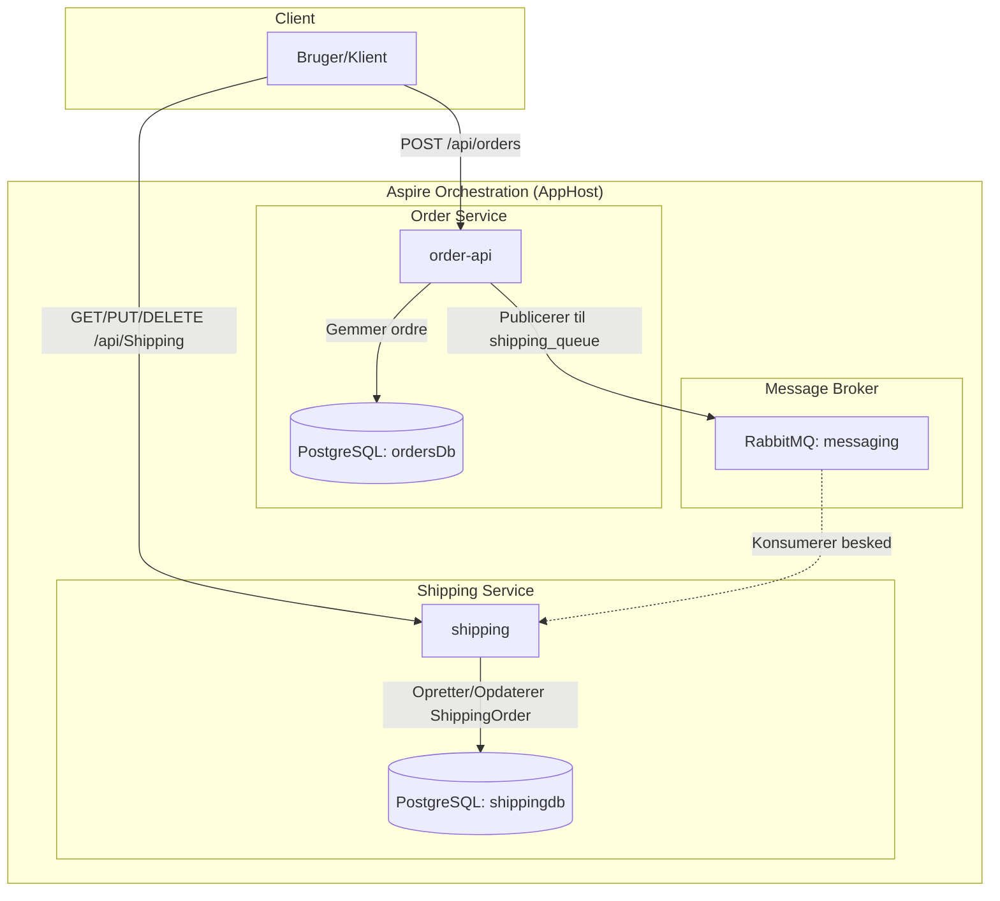
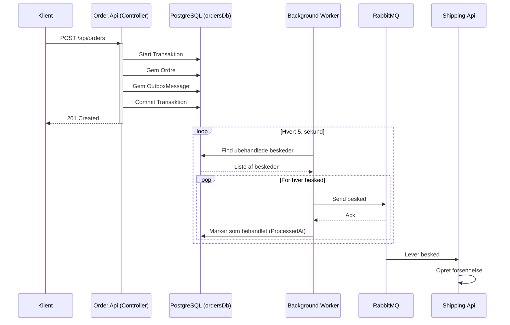

# SystemIntegration10 - Arkitekturbeskrivelse

Dette projekt er en distribueret løsning bygget med **.NET 10** og **.NET Aspire**, der demonstrerer integration mellem mikroservices ved brug af asynkron beskedudveksling via **RabbitMQ** og datalagring i **PostgreSQL**.

## Arkitekturoversigt

Løsningen består af to primære API-services, der kommunikerer asynkront:

1.  **Order.Api**: Ansvarlig for håndtering af ordrer. Når en ordre oprettes, gemmes den i sin egen database, og en besked sendes til en kø i RabbitMQ.
2.  **shipping** (Shipping.Api): Ansvarlig for forsendelse. Den lytter på RabbitMQ-køen (`shipping_queue`) og opretter en forsendelsesordre i sin egen database, når en ny ordre-besked modtages. Den udstiller desuden et REST API (`/api/Shipping`) til overvågning og opdatering af forsendelsesstatus.
3.  **RabbitMQ**: Fungerer som message broker, der sikrer løs kobling (loose coupling) mellem de to services.
4.  **PostgreSQL**: Anvendes som persistent lagring med separate databaser for hver service (`ordersDb` til ordrer og `shippingdb` til forsendelse).
5.  **AppHost**: Fungerer som orkestrator (Aspire), der forbinder alle dele og håndterer infrastruktur som containere og konfiguration.

## Systemdiagram



## Kom i gang
1. Sørg for at have Docker Desktop eller lignende kørende.
2. Kør `SystemIntegration10.AppHost` projektet.
3. Brug Aspire Dashboardet. I kan tilgå scalar webinterfacet for begge webapi'er
4. I kan tilgå Postgres databaserne via pgweb admin værktøjet.


## Teknologier
- **Framework:** .NET 10
- **Orkestrering:** .NET Aspire
- **Beskedkø:** RabbitMQ (via Aspire RabbitMQ Client)
- **Database:** PostgreSQL (via Aspire Npgsql EntityFrameworkCore)
- **API:** ASP.NET Core Controllers

## Opgave: Implementering af Outbox Pattern

Den nuværende implementering i `Order.Api` gemmer en ordre i databasen og forsøger derefter at sende en besked til RabbitMQ:

```csharp
[HttpPost]
public async Task<ActionResult<Order>> PostOrder(Order order)
{
    order.Id = Guid.NewGuid();
    _context.Orders.Add(order);
    await _context.SaveChangesAsync(); // Gemmer i DB
    try
    {
        await _sender.SendMessageAsync(order); // Forsøger at sende besked
    }
    catch (Exception exception)
    {
        _logger.LogError(exception, "Failed to send message to RabbitMQ");
    }
    return CreatedAtAction("PostOrder", new { id = order.Id }, order);
}
```

Hvis RabbitMQ er nede, eller netværket fejler efter ordren er gemt, vil beskeden aldrig blive sendt, hvilket skaber inkonsistens mellem systemerne.

### Flow-diagram for Outbox Pattern



**Mål:** Implementer **Outbox Pattern** for at sikre, at ordrer og beskeder håndteres atomart.

### Trin:
1.  **Opret en Outbox tabel:** Tilføj en `OutboxMessage` model til `Order.Api` (f.eks. med `Id`, `Type`, `Payload` som JSON, og `ProcessedAtUTC`).
2.  **Atomar gem-operation:** Opdater `OrdersController.PostOrder` til at gemme både ordren og en tilsvarende `OutboxMessage` i den samme database-transaktion. Fjern det direkte kald til `IShippingMessageSender`.
3.  **Implementer en Background Worker:** Opret en `BackgroundService` i `Order.Api`, der periodisk (f.eks. hvert 5. sekund) poller databasen for ubehandlede beskeder.
4.  **Send og marker:** For hver ubehandlet besked i worker-servicen:
    *   Send beskeden via `IShippingMessageSender`.
    *   Marker beskeden som behandlet i databasen (`ProcessedAtUTC = DateTime.UtcNow`).
5.  **Test fejltolerance:** Stop RabbitMQ-containeren, opret en ordre, og verificer at beskeden ligger i Outbox-tabellen. Start derefter RabbitMQ igen og se worker-servicen aflevere beskeden til `shipping` servicen.

